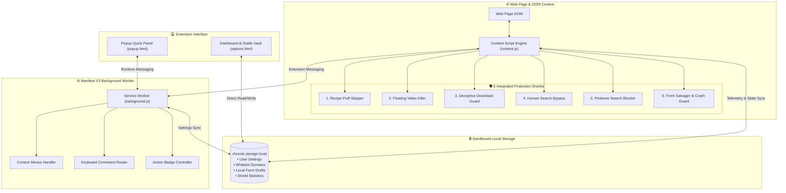
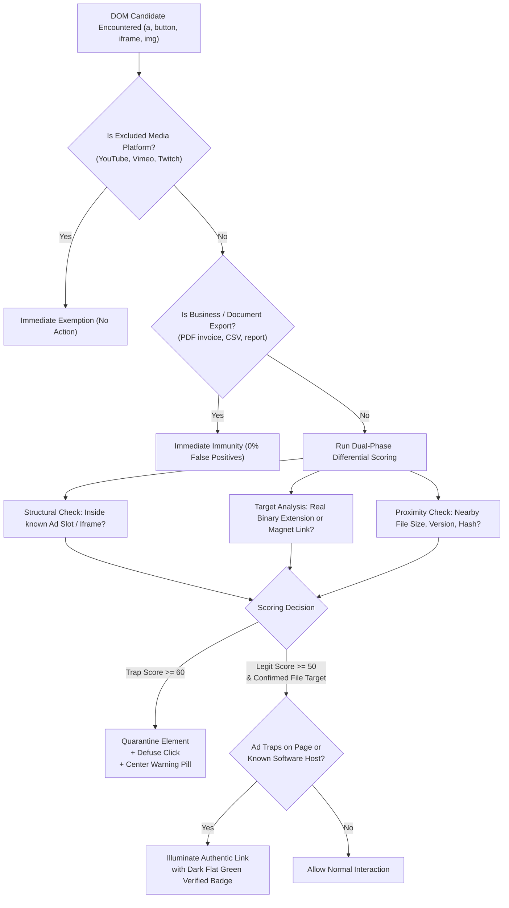

<p align="center">
  
</p>

<h1 align="center">ZenWeb — Digital Peace Suite</h1>

<p align="center">
  <strong>The all-in-one browser utility that removes modern web clutter, defuses deceptive traps, and protects your work.</strong>
</p>

<p align="center">
  
  
  
  
  
  
  
</p>

---

## 📖 Overview

The modern web is plagued by intrusive newsletter popups, auto-floating corner videos, deceptive download bait, SEO-stuffed recipes, and unexpected crashes that wipe out hours of typed form text.

Rather than running multiple heavy, rule-based adblockers and disjointed single-purpose tools, **ZenWeb** provides a lightweight, unified suite of **6 zero-configuration protection shields**. It operates with **zero telemetry**, **zero remote scripts**, and stores all preferences and drafts strictly on your local machine.

---

## 🏛️ High-Level System Architecture



---

## 🛡️ The 6 Core Protection Shields

### 1. 🍳 Recipe Fluff & Story Skipper
- **The Problem:** Recipe blogs bury essential ingredients beneath thousands of words of SEO storytelling, affiliate banners, and life anecdotes.
- **The Engine:** Automatically parses `schema.org/Recipe` JSON-LD microdata and DOM semantic structures upon page load.
- **Actions:**
  - Injects a floating **"Jump to Recipe"** shortcut (`Alt+Shift+J`) that scrolls directly to ingredients and preparation instructions.
  - Features an integrated, distraction-free **Reader View** modal that isolates ingredients and steps in a clean typography view.

### 2. 📹 Sticky Floating Video Killer
- **The Problem:** Commercial news sites detach videos and lock them into corners as floating Picture-in-Picture widgets that obscure text and distract reading.
- **The Engine:** Leverages pure viewport geometry, bounding box aspect ratios (16:9 / 4:3), and corner-docking heuristics to identify intrusive outstream video widgets.
- **Immunity Protections:** Strictly avoids suppressing intentional players (e.g. fullscreen video, dominant media > 55% viewport size, or native video controls).
### 3. 🛑 Deceptive "Fake Download" Guard
- **The Problem:** File-sharing sites, mirrors, and forums display deceptive green "Download" image banners and clickjacking overlays that trick users into downloading adware.
- **The Engine:** Employs a Dual-Phase Differential Scoring Engine:
  - **Quarantine:** Blurs fake buttons and centers an Apple SF-style quarantine warning pill over deceptive traps.
  - **Verified Beacon:** Analyzes surrounding DOM metadata (file size, version, direct binary extension `.zip`, `.exe`, `.dmg`, `.tar.gz`, `.apk`, `.iso`, or `magnet:` URIs). If legitimate download criteria are met, illuminates the authentic button with a dark flat green **"Verified"** pill badge.
  - **Platform Immunity:** Excludes video streaming platforms (YouTube, Vimeo, Twitch) and business SaaS exports (PDF invoices, CSV exports).



### 4. 🔍 Human Search Bypass
- **The Problem:** Search engines are saturated with SEO content farms and low-quality AI rehashes.
- **The Engine:** Injects an ergonomic toggle button below the search input on Google, Bing, and DuckDuckGo:
  - Automatically appends targeted human discussion queries (`site:reddit.com OR site:quora.com OR site:news.ycombinator.com ...`).
  - Badges authentic community discussions directly in search result snippets.

### 5. 📌 Pinterest Search Blocker
- **The Problem:** Google Image searches are flooded with Pinterest links that trap users behind forced login walls.
- **The Engine:** Real-time mutation observer identifies image search cards pointing to Pinterest domains and cleanly hides them (`display: none`).
- **Telemetry:** Displays a live, unobtrusive counter of hidden Pinterest spam in the page corner with an instant toggle to unhide if desired.

### 6. ✍️ Form Salvager & Crash Guard
- **The Problem:** Spending 20 minutes typing a complex form, support ticket, or article draft, only for the browser tab to crash or reload and lose all input.
- **The Engine:**
  - Real-time continuous checkpointing for `<textarea>`, `<input>`, `<select>`, radio groups, checkboxes, and `contenteditable` editors.
  - **SPA Reactivity:** Invokes native prototype property setters for React, Vue, and Angular applications to ensure state synchronization upon restore.
  - **Revision History:** Maintains a rolling 48-hour revision timeline of edits.
  - **Strict Privacy Shield:** Automatically blacklists and ignores passwords, credit cards, CVVs, PINs, OTPs, and authentication tokens via regex guards.

---

## 📂 Project Directory Structure

```
Browser-Extensions-Business/
├── manifest.json              # Manifest V3 extension configuration
├── CHROMEWEBSTORE.md          # Complete store listing copy, permissions & review guide
├── PRIVACY.md                 # Public on-device privacy policy for store listing
├── vite.config.ts             # Vite 8 multi-entry build configuration
├── types.d.ts                 # Central TypeScript interfaces & message types
├── .gitignore                 # Comprehensive git exclusion rules
│
├── background/
│   └── background.ts          # Service worker: lifecycle, commands, context menus
│
├── content/
│   ├── index.ts               # Master content script entry point
│   ├── storage.ts             # Storage access, setting reactive listeners & telemetry
│   └── corner-stack.ts        # Floating corner HUD notification manager
│
├── features/                  # Independent, modular protection shields
│   ├── fake-download-guard/   # Deceptive download detection & beacon illumination
│   │   ├── logic.ts           # Dual-phase scoring algorithm & target validators
│   │   └── ui.ts              # Apple SF quarantine pill & dark flat green beacon
│   ├── form-salvager/         # Anti-crash auto-save & draft restoration engine
│   │   ├── logic.ts           # Multi-field form detector, revision tracking, sensitive regex
│   │   └── ui.ts              # Floating restore pill, draft selector & toasts
│   ├── human-search/          # Google/Bing discussion bypass & SEO farm flagger
│   │   ├── logic.ts           # Search route detection & query modifier
│   │   ├── constants.ts       # Human discussion domain lists
│   │   └── ui.ts              # Search bar injection & result badges
│   ├── pinterest-blocker/     # Google Images Pinterest filter
│   │   ├── logic.ts           # Search result mutation observer
│   │   └── ui.ts              # Minimal spam counter HUD
│   ├── recipe-skipper/        # Recipe JSON-LD parser & distraction-free reader
│   │   ├── logic.ts           # Schema.org parser & jump coordinates
│   │   └── ui.ts              # Jump button & isolated recipe reader modal
│   └── video-killer/          # Sticky floating outstream video suppressor
│       ├── logic.ts           # Viewport geometry & corner-docking heuristics
│       └── ui.ts              # Media suppression styles & HUD notification
│
├── popup/                     # Quick action extension popup
│   ├── popup.html             # Popup layout (SVG ring counter, master switch)
│   ├── popup.css              # Custom styling & dark mode aesthetic
│   ├── logic.ts               # Ring animation, telemetry counter, domain whitelist
│   └── ui.ts                  # Toast notifications & status binding
│
├── options/                   # React 19 Full Settings & Drafts Vault Dashboard
│   ├── options.html           # Dashboard HTML container
│   ├── options.css            # Tailwind CSS 4 theme & typography
│   ├── main.tsx               # React application root
│   ├── Dashboard.tsx          # Full dashboard view: settings, whitelist, telemetry
│   └── vaultSearch.ts         # Saved drafts search & restore utilities
│
├── components/                # Reusable UI component library (shadcn/radix)
│   └── ui/                    # Button, Card, Switch, Tabs, Badge, Separator
│
├── assets/                    # Pixel-perfect PNG icons (16, 32, 48, 128) & local fonts
├── test/                      # Unit testing specs (fake-download-guard.spec.ts)
└── dist/                      # Production build output (packaged for Chrome Web Store)
```

---

## 🔒 Security & Chrome Web Store Compliance

ZenWeb is engineered to strictly follow Google Chrome Web Store Developer Program Policies:

| Policy Requirement | ZenWeb Implementation |
|---|---|
| **Zero Remote Code** | All JavaScript, CSS, and fonts are compiled locally into the extension bundle. No CDN scripts or runtime `eval()` are permitted. |
| **XSS Prevention** | 100% of UI elements injected into pages are built using DOM APIs (`createElement`, `textContent`). Zero use of `innerHTML`. |
| **Data Privacy** | All user data (whitelists, settings, salvaged form drafts) is kept locally in `chrome.storage.local`. Zero telemetry or server transmission. |
| **Sensitive Data Protection** | Form Salvager explicitly excludes passwords, credit card numbers, CVVs, PINs, and auth tokens via regex blacklisting. |
| **Single Purpose** | Dedicated strictly to web browsing clutter elimination and workflow protection. |
| **Minimal Permissions** | Requests only essential permissions (`storage`, `activeTab`, `contextMenus`, host permissions). Zero unused permissions (e.g. `scripting` is completely omitted). |

---

## ⌨️ Keyboard Shortcuts

| Shortcut | Description |
|---|---|
| `Alt + Shift + Z` | Open the ZenWeb Quick Action Popup |
| `Alt + Shift + J` | **Quick View**: Extract and jump straight to recipe ingredients and instructions |

*Shortcuts can be customized anytime at `chrome://extensions/shortcuts`.*

---

## 🛠️ Local Development & Build

### Prerequisites
- [Node.js](https://nodejs.org/) v18.0.0 or higher
- `npm` or `pnpm`

### Installation
```bash
git clone https://github.com/shibasishdas043/Browser-Extensions-Business.git
cd Browser-Extensions-Business
npm install
```

### Development (Live Rebuild)
```bash
npm run dev
```

### Type Checking & Unit Tests
```bash
# Validate TypeScript compiler integrity
npm run typecheck

# Run the Fake Download Guard test suite (85 unit tests)
npx tsx test/fake-download-guard.spec.ts
```

### Production Build
```bash
npm run build
```
The compiled, optimized distribution bundle will be generated in the `dist/` directory.

### Loading Unpacked in Chrome
1. Open Google Chrome and navigate to `chrome://extensions`.
2. Enable **Developer mode** via the toggle switch in the top-right corner.
3. Click **Load unpacked**.
4. Select the `dist/` folder inside this repository.
5. The **ZenWeb** shield icon will appear in your Chrome toolbar.

---

## 🚀 Chrome Web Store Submission Guide

The repository includes complete, copy-paste assets and review forms ready for the [Chrome Web Store Developer Dashboard](https://chrome.google.com/webstore/devconsole):

- **Store Metadata & Justifications**: View [`CHROMEWEBSTORE.md`](CHROMEWEBSTORE.md) for pre-written titles, 132-character summaries, item descriptions, permission justifications, and reviewer testing steps.
- **Privacy Policy**: Hosted at [`PRIVACY.md`](PRIVACY.md) and publicly viewable on GitHub.
- **Icons**: Store icon (128×128) and toolbar icons (16×16, 32×32, 48×48) are located in `assets/`.

### Packaging the Extension ZIP
To generate the distribution archive for submission:

```powershell
# Build latest optimized production bundle
npm run build

# Create clean ZIP archive containing dist/ contents
Compress-Archive -Path dist\* -DestinationPath zenweb-v1.0.0.zip -Force
```

Upload `zenweb-v1.0.0.zip` directly under the **Package** tab in the Chrome Developer Dashboard.

---

## 📄 License

This project is licensed under the [MIT License](LICENSE).